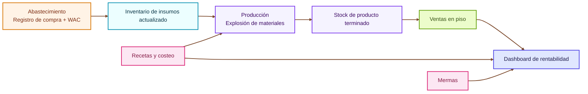
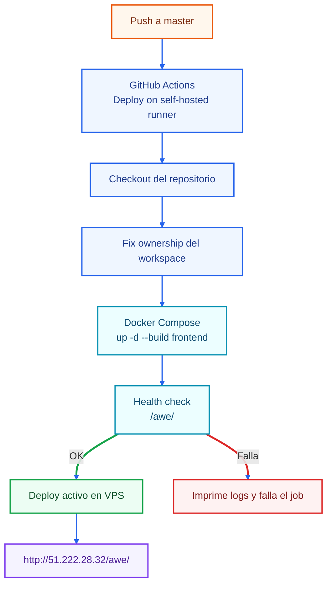

# KitchenFlow

Proyecto académico de la materia **Aplicaciones Web Escalables (224501)** de la **Universidad Autónoma de San Luis Potosí (UASLP)**.

Autor: **Miguel Alejandro Gutiérrez Silva**  
Programa: Ingeniería en Computación  
Semestre: **10mo semestre**

## Idea general del proyecto

**KitchenFlow** es una propuesta de sistema para control operativo y financiero de cafeterías. La aplicación integra módulos de:

- Recetas y costeo.
- Producción y mermas.
- Abastecimiento con costo promedio ponderado (WAC).
- Ventas en piso.
- Dashboard de rentabilidad con KPIs.

La idea central es conectar inventario, producción y ventas para tener trazabilidad de costos y apoyar la toma de decisiones.

## UI y componentes

La interfaz frontend usa un sistema de componentes **inspirado en ZardUI**, implementado localmente dentro del proyecto (no como dependencia npm externa):

- Referencia visual y de API: https://zardui.com/
- Componentes base reutilizables (`z-button`, `z-card`, `z-badge`, `z-input`, `z-table`) definidos en `frontend/src/app/shared/components/`.

## Estructura del repositorio

```text
.
├── backend/                  # API Node.js/Express
│   ├── src/
│   ├── Dockerfile
│   └── package.json
├── frontend/                 # App Angular (interfaz KitchenFlow)
│   ├── src/
│   ├── Dockerfile
│   └── package.json
├── .github/
│   └── workflows/
│       └── deploy-selfhosted.yml  # CI/CD simple para deploy
├── docker-compose.yml        # Orquestación de servicios
├── propuesta/                # Documento y material de propuesta (LaTeX, diagramas, mockups)
└── clase-ejemplo/            # Material auxiliar de clase
```

## Contenedores y deployment

El proyecto está planteado con contenedores Docker para facilitar el despliegue y la portabilidad entre entornos.

- Se usa `docker-compose.yml` para levantar servicios.
- El frontend se expone en el puerto `4200` dentro del servidor.
- Nginx publica la app bajo la ruta `/awe/`.

Esto simplifica la puesta en marcha en VPS y reduce diferencias entre desarrollo y servidor.

## CI/CD simple

Se implementó un flujo básico de CI/CD con GitHub Actions en un **runner self-hosted**:

- Archivo: `.github/workflows/deploy-selfhosted.yml`
- Disparador: `push` a la rama `master` (y ejecución manual con `workflow_dispatch`).
- Acción principal: reconstruir y levantar el servicio frontend con Docker Compose.
- Incluye una verificación de salud (`health check`) contra `http://127.0.0.1:4200/awe/`.

## Diagramas Mermaid

### Flujo funcional de KitchenFlow



### Flujo de CI/CD (simple)



## URL de revisión

La versión desplegada puede revisarse en:

**http://51.222.28.32/awe/**
